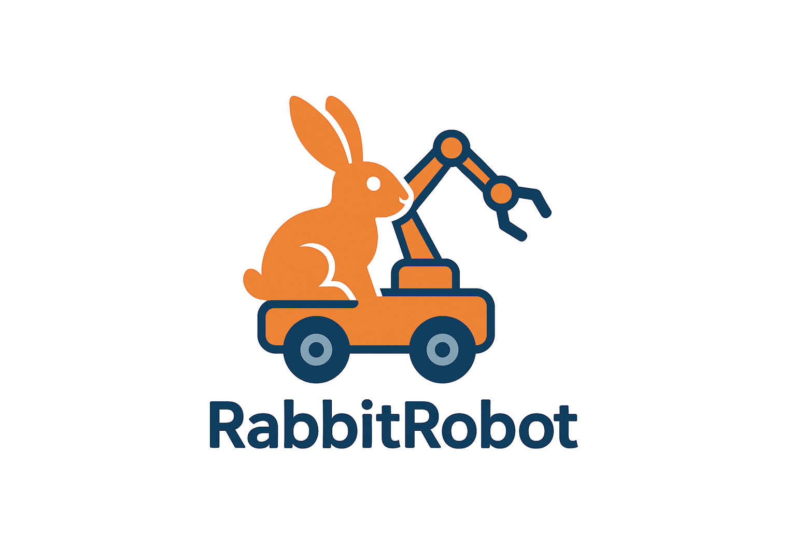
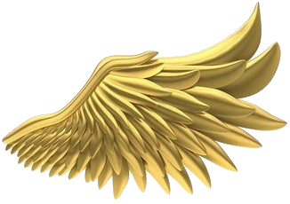
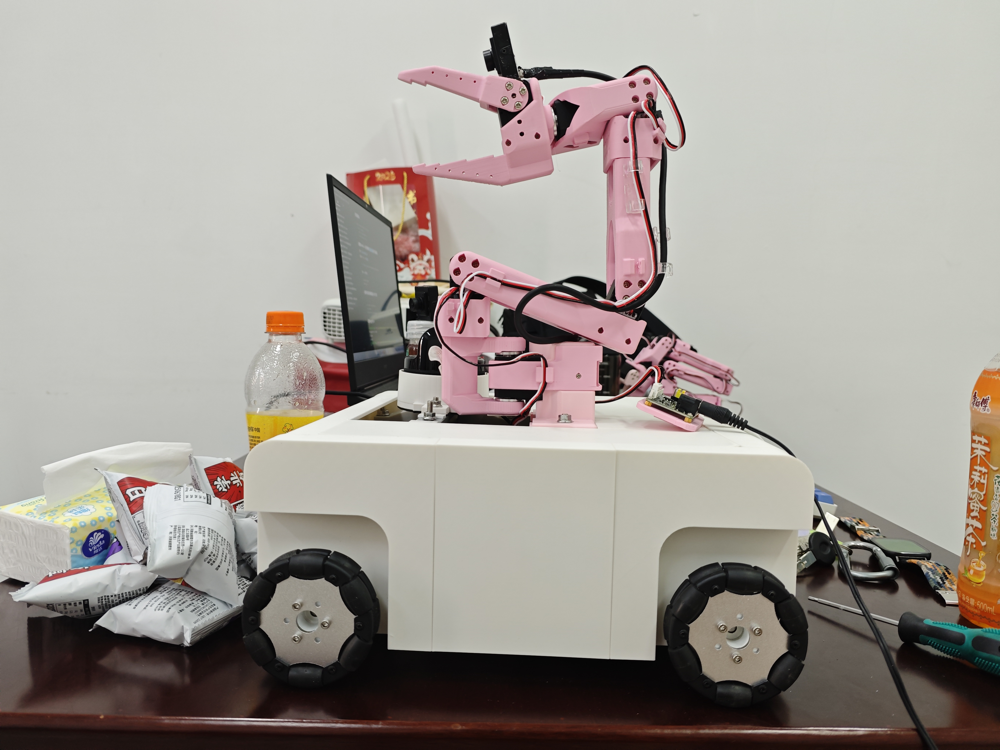
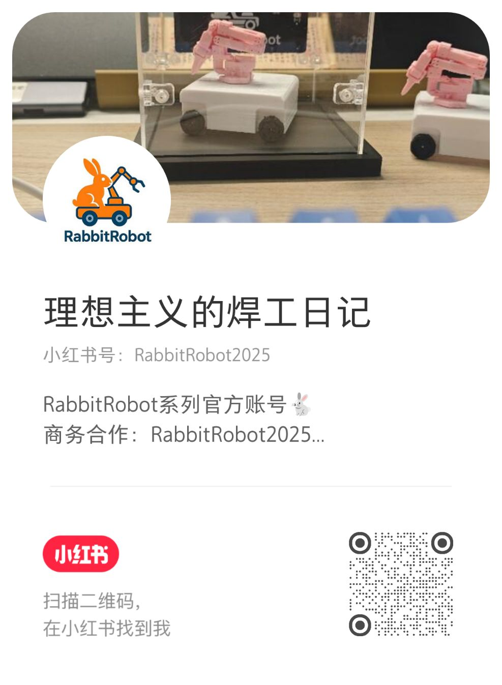

<h1 align="center">🦾 努力，让世界听到 RabbitRobot 的声音 🤖</h1>

  
  
  

<picture>
  <source media="(prefers-color-scheme: dark)" srcset="./profile-snake-contrib/github-contribution-grid-snake-dark.svg" />
  <source media="(prefers-color-scheme: light)" srcset="./profile-snake-contrib/github-contribution-grid-snake.svg" />
  
</picture>

---

<h1 align="center">lijinghai · RabbitRobot</h1>

  <strong>Control Engineering · Autonomous Driving · Robotics Systems</strong>

  <a href="https://lijinghai.github.io/" target="_blank">Homepage</a> ·
  <a href="https://blog.csdn.net/Dorian15" target="_blank">CSDN Blog</a> ·
  <a href="https://space.bilibili.com/1339027047" target="_blank">Bilibili</a> ·
  <a href="mailto:lijinghailjh@163.com">Email</a>

  
  
  
  

## About Me

你好，我是 **lijinghai**。我正在做 **RabbitRobot**：一个从 ROS 2 小车、多传感器融合到自动驾驶决策逐步长出来的开源机器人平台。

我是一名控制工程方向的硕士研究生，研究兴趣集中在自动驾驶规划与决策、多传感器融合定位建图，以及具身智能系统的工程实现。我更关注能够跑在真实硬件上的系统闭环：从传感器、嵌入式驱动、机器人中间件，到算法验证、Web 控制与云端部署。

- **Current Focus:** 端到端自动驾驶策略生成与优化，ROS 2 机器人系统，多传感器融合 SLAM。
- **Engineering Goal:** 以全栈工程能力支撑自动驾驶与机器人系统落地。
- **Platform:** RabbitRobot 系列机器人平台，持续用于算法验证、系统集成和公开技术记录。

## Research Interests

| Direction | Topics |
| :--- | :--- |
| Autonomous Driving | planning and decision-making, end-to-end policy generation, trajectory optimization |
| SLAM & Localization | Cartographer, FAST-LIO2, Point-LIO, RTAB-Map, LiDAR-camera-IMU fusion |
| Robotics Systems | ROS 2, Jetson deployment, sensor calibration, embedded control, web-based robot operation |
| Embodied AI | LeRobot, VLA models, teleoperation data collection, Sim2Real manipulation |
| Edge AI | YOLO deployment, model compression, Docker/Nginx based services, UWB multi-source fusion |

## Technical Profile

| Layer | Stack |
| :--- | :--- |
| Languages | Python, C++, Java, JavaScript / TypeScript |
| Robotics | ROS 2, Autoware, UniAD, RTAB-Map, Cartographer, FAST-LIO2, Point-LIO |
| Sensors | 3D/4D LiDAR, depth camera, IMU, UWB, multi-sensor calibration and fusion |
| AI / Perception | YOLO series, BEV perception, HuggingFace, LeRobot, VLA |
| Systems | Linux, Docker, Nginx, MySQL, Jetson, Vue, React, Spring Boot |

  

## Selected Projects

### RabbitRobot Open Autonomous Platform

RabbitRobot 是我当前最核心的工程平台，用于自动驾驶、SLAM、多传感器融合和 ROS 2 系统集成实验。

- **Repositories:** [RabbitRobot-D435-L1lidar-RTABMap-ROS2](https://github.com/lijinghai/RabbitRobot-D435-L1lidar-RTABMap-ROS2), [ljh_robot_ros2_web](https://github.com/lijinghai/ljh_robot_ros2_web)
- **Keywords:** ROS 2, LiDAR, RTAB-Map, Jetson, depth camera, web control, autonomous navigation
- **Engineering Value:** 从硬件小车、传感器接入、SLAM 建图到 Web 控制界面的完整系统闭环
- **Demo:** [RabbitRobot_V1.0 on Bilibili](https://www.bilibili.com/video/BV1zkYsziExS/?spm_id_from=333.1387.list.card_archive.click)

  
   
  RabbitRobot V1.0 · ROS 2 · multi-sensor fusion · SLAM · autonomous navigation

### WarmSearch Campus Lost-and-Found System

WarmSearch 是一个面向校园场景的失物招领系统，覆盖后端服务、Web 前端与 UniApp 移动端。

- **Repositories:** [WarmSearch](https://github.com/lijinghai/WarmSearch), [WarmSearch-uniapp](https://github.com/lijinghai/WarmSearch-uniapp)
- **Keywords:** Spring Boot, Vue, UniApp, MySQL, campus service system
- **Engineering Value:** 从业务建模、接口设计到多端交互的完整应用系统实践

### Embodied AI Manipulation

围绕 LeRobot 与 VLA 模型搭建机械臂自主抓取实验链路，关注遥操作数据采集、训练、推理部署和 Sim2Real 迁移。

- **Keywords:** LeRobot, VLA, teleoperation, robot arm grasping, Sim2Real
- **Engineering Value:** 将视觉-语言-动作模型接入真实机器人控制流程，验证具身智能系统的端到端落地能力

## Engineering Experience

- 控制工程专业硕士研究生，长期关注自动驾驶、机器人系统与具身智能。
- 具备从硬件设计、嵌入式驱动、算法验证到云端部署的全栈式系统开发经验。
- 担任校实验室总负责人，参与团队技术攻关与项目管理，带领团队多次获得国家级奖项。
- 持续维护 RabbitRobot 技术记录与开源项目，希望把研究问题转化为可复现、可运行、可迭代的工程系统。

## GitHub Activity

  

## Find Me

除了 GitHub，你也可以在这些平台找到 RabbitRobot 的公开更新和联系方式。

| 小红书 | 微信 | B站 |
| :---: | :---: | :---: |
|  |  |  |
| **理想主义的焊工日记** 小红书号：`RabbitRobot2025` | **理想主义的焊工日记** 扫码添加我为朋友 | **理想主义的焊工日记** <a href="https://space.bilibili.com/1339027047" target="_blank">UID: 1339027047</a> |
